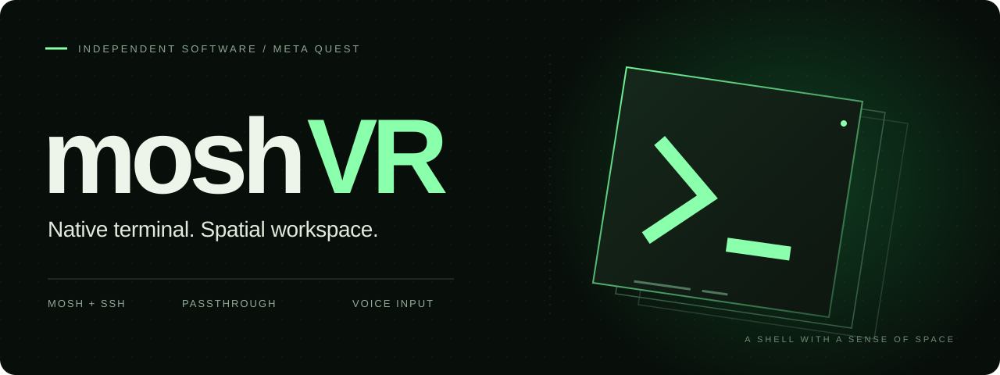

<p align="center">
  
</p>

<p align="center">
  <strong>Your remote shell. A workspace you can step into.</strong>
</p>

<p align="center">
  <a href="https://sidequestvr.com/app/62512"><strong>Get on SideQuest ↗</strong></a>&nbsp;&nbsp;·&nbsp;&nbsp;
  <a href="#install--run">Install &amp; run</a>&nbsp;&nbsp;·&nbsp;&nbsp;
  <a href="docs/USAGE.md">Controls</a>&nbsp;&nbsp;·&nbsp;&nbsp;
  <a href="SUPPORT.md">Get help</a>&nbsp;&nbsp;·&nbsp;&nbsp;
  <a href="docs/ROADMAP.md">Roadmap</a>
</p>

moshVR is a native **mosh and SSH client for Meta Quest**. Bring a shell,
a tmux workspace, or a terminal editor into VR. Work in a Home panel, or
move into a spacious immersive terminal with passthrough and digital rain.
The client runs on your headset; the shell runs on your server.

## Features

<table>
<tr>
<td width="50%" valign="top">
<h3>⌘ &nbsp; Familiar tools, more room</h3>
An xterm-256color terminal, multiple session tabs, and the shell tools you
already use. Put the terminal beside your apps or give it a wall of its own.
</td>
<td width="50%" valign="top">
<h3>↗ &nbsp; Take your connection with you</h3>
Mosh recovers from network drops while the app process stays alive.
Choose plain SSH when you only need a stream connection.
</td>
</tr>
<tr>
<td width="50%" valign="top">
<h3>⌁ &nbsp; Made for spatial input</h3>
Quest keyboard, terminal extra keys, controller scrolling and immersive
hand microgestures. Switch local tabs or control remote tmux windows.
</td>
<td width="50%" valign="top">
<h3>›_ &nbsp; Speak. Review. Send.</h3>
Optional cloud transcription with SiliconFlow / OpenAI-compatible services, Qwen ASR, or Volcengine speech puts text in the composer. Read it, edit it,
and send it to your host when you are ready.
</td>
</tr>
</table>

## Install & run

### SideQuest (Recommended)

moshVR is distributed on SideQuest as an Early Access release:

👉 **[Install via SideQuest (App #62512)](https://sidequestvr.com/app/62512)**

Connect your Quest in Developer Mode and install directly with the SideQuest app or web installer.

### Build from source

You need a Quest running **Android API 34+**, Developer Mode, and a reachable
SSH server. For mosh connections, install `mosh-server` on the server too.

After [setting up JDK 17, Android SDK and NDK](docs/BUILDING.md#toolchain):

```sh
./third_party/mosh/build-mosh-client.sh
./gradlew :app:assembleDebug
adb -s YOUR_HEADSET_SERIAL install -r app/build/outputs/apk/debug/app-debug.apk
```

Open moshVR in **Unknown Sources**, choose **New host**, and verify your server's
host-key fingerprint on the first connection. Set `tmux new -As main` as the
startup command to reattach to a persistent remote workspace.

[Full build instructions →](docs/BUILDING.md) &nbsp; [Connection help →](SUPPORT.md)

## Good to know

<details>
<summary><strong>What survives a disconnect?</strong></summary>

Mosh can recover while its local process remains alive. If Android kills the
app, reconnect. Running tmux on the server keeps the remote shell available
to reattach; it does not preserve the local moshVR process.

</details>

<details>
<summary><strong>Where do my credentials and voice go?</strong></summary>

Saved passwords, keys and speech API keys are encrypted with Android Keystore.
SSH credentials authenticate to your host. Optional cloud speech requires
your API key and endpoint consent: **MIC STOP uploads audio to the speech
provider**, and composer **Send** sends the resulting text to your SSH host.
The developer does not receive your terminal sessions or recordings. Meta's
SDK and Horizon OS have their own data practices. [Read the privacy policy](PRIVACY.md).

</details>

<details>
<summary><strong>Do I need cloud speech?</strong></summary>

No. Use the Quest keyboard and terminal controls without configuring a speech
provider. Quest keyboard dictation, if enabled, is handled by Horizon OS.
See [controls and voice](docs/USAGE.md) and [provider setup and verification](docs/SPEECH-PROVIDERS.md).

</details>

## Built on good foundations

[Termux](https://github.com/termux/termux-app) for terminal emulation ·
[mosh](https://mosh.org) for roaming connections ·
[ConnectBot sshlib](https://github.com/connectbot/sshlib) for SSH ·
Meta Spatial SDK for the workspace.

Want to help? Start with [contributing](CONTRIBUTING.md), explore the
[architecture](docs/ARCHITECTURE.md), or report a reproducible issue through
[the support guide](SUPPORT.md).

---

Made by **[neyham](https://github.com/neyham)** · Independent software for Quest.

[GPLv3](LICENSE) for moshVR code; dependencies retain their own licenses as noted in [THIRD_PARTY.md](THIRD_PARTY.md).
Early Access package is distributed on [SideQuest](https://sidequestvr.com/app/62512).
